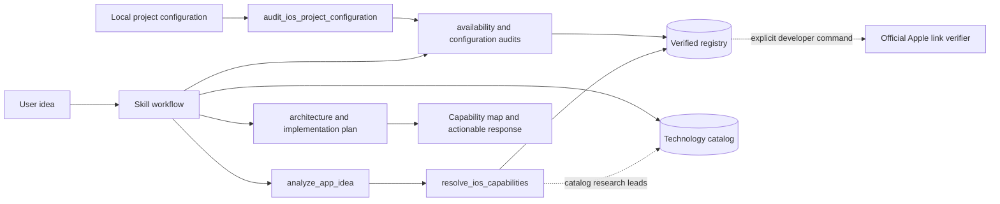

# Architecture

## Components

1. Plugin manifest: identity, discovery metadata, skill path, and MCP path.
2. Skill: complete expert behavior, source policy, analysis workflow, standard output, code rules, tests, and safety boundaries.
3. MCP server: fifteen read-only tools over stdio.
4. Schema layer: Zod contracts for tool input and normalized registry records.
5. Registry loader: explicit knowledge-state preservation, uniqueness checks, official-source validation, and in-process cache.
6. Recommendation engine: deterministic requirement extraction, relevance scoring, availability checks, project-aware audits, architecture, and delivery plan.
7. Registry: reviewed recommendation profiles plus a separate measured discovery catalog sourced from official Apple indexes.
8. Developer scripts: schema validation and live link verification.
9. Tests: registry integrity, trigger fixtures, and acceptance scenarios.

## Data flow

## Deliberate boundaries

- Product reasoning remains in the skill/model; registry claims remain structured and testable.
- The runtime has no write path. Registry refresh is a reviewed repository workflow.
- Local project inspection is bounded to configuration surfaces, does not follow symlinks, and does not return source contents.
- Live web search is not hidden behind a tool named search. `search_official_apple_docs` searches the verified local index and says so.
- Stable and beta records can coexist without beta leaking into default recommendations.
- Permissions, purpose strings, capabilities, entitlements, managed entitlements, extensions, and background modes retain separate fields end to end.

## Scaling path

The starter local MCP server is the smallest deployable shape. A future public web-capable version can keep schemas and engine code while replacing stdio with a reviewed HTTPS MCP transport, adding rate limits and observability, and introducing authentication only if user-specific external data is added.
